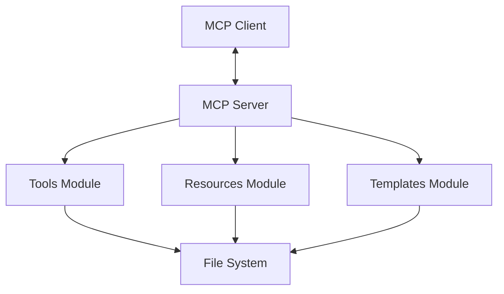

# MCP Notes System Patterns

## System Architecture

MCP Notes follows a modular architecture with clear separation of concerns:



1. **MCP Server**: The core component that handles communication with MCP clients using the MCP protocol.
2. **Tools Module**: Implements the various tools (log, rollup, search, etc.) that perform operations on notes.
3. **Resources Module**: Provides access to notes as resources that can be discovered and read by MCP clients.
4. **Templates Module**: Manages templates for consistent formatting of notes and rollups.
5. **File System**: The storage layer where notes are persisted as markdown files.

## Key Technical Decisions

1. **MCP Protocol**: Using the Model Context Protocol for communication between the server and clients provides a standardized way for AI assistants to interact with the notes system.

2. **JavaScript/Node.js**: The system is implemented in JavaScript using Node.js, providing a lightweight and efficient runtime for the server.

3. **Markdown Storage**: Notes are stored as markdown files, making them human-readable, portable, and compatible with other tools.

4. **Template-Based Formatting**: Using templates for note formatting ensures consistency and allows for customization.

5. **Directory-Based Organization**: Notes are organized in directories by type (Log, Rollups) and date, creating a clear and navigable structure.

## Design Patterns

1. **Command Pattern**: Each tool (log, rollup, search, etc.) is implemented as a command that performs a specific operation.

2. **Repository Pattern**: The resources module acts as a repository, providing a consistent interface for accessing notes.

3. **Template Method Pattern**: The template loading and processing system uses this pattern to define the skeleton of operations while allowing specific steps to be overridden.

4. **Facade Pattern**: The MCP server provides a simplified interface to the complex subsystems (tools, resources, templates).

5. **Singleton Pattern**: The server instance is a singleton, ensuring a single point of access to the system.

## Component Relationships

### MCP Server and Tools

The MCP server receives tool calls from clients and dispatches them to the appropriate tool handler:

```javascript
server.setRequestHandler(CallToolRequestSchema, async (request) => {
  const { name, arguments: args } = request.params;
  return handleToolCall(NOTES_PATH, name, args);
});
```

The `handleToolCall` function then routes the call to the specific tool implementation based on the tool name.

### Tools and File System

Tools interact with the file system to read and write notes:

```javascript
async function createDailyLog(notesPath, notes = "") {
  // Ensure log directory exists
  const logDir = path.join(notesPath, 'Log');
  await ensureDirectory(logDir);
  
  // Get date info and format path
  const dateInfo = formatDate();
  const logPath = path.join(logDir, `${dateInfo.isoDate}.md`);
  
  // Read or create file
  // Write updated content
}
```

### Templates and Note Generation

The template system loads templates and replaces placeholders with values:

```javascript
async function loadAndProcessTemplate(templateName, values = {}) {
  const template = await loadTemplate(templatePath);
  return processTemplate(template, values);
}

function processTemplate(template, values) {
  return template.replace(/\{\{(\w+)\}\}/g, (match, key) => {
    return values[key] !== undefined ? values[key] : match;
  });
}
```

### Resources and MCP Protocol

The resources module exposes notes as MCP resources that can be discovered and accessed by clients:

```javascript
server.setRequestHandler(ListResourcesRequestSchema, async () => {
  return resourceProvider.listResources();
});

server.setRequestHandler(ReadResourceRequestSchema, async (request) => {
  return resourceProvider.readResource(request.params.uri);
});
```

## Data Flow

1. **Note Capture**:
   - MCP client sends a tool call to the server
   - Server routes the call to the log tool
   - Log tool appends the note to the daily log file
   - Server returns confirmation to the client

2. **Rollup Generation**:
   - MCP client sends a tool call to the server
   - Server routes the call to the rollup tool
   - Rollup tool reads the daily log
   - Rollup tool categorizes notes and generates a summary
   - Rollup tool writes the summary to a rollup file
   - Server returns confirmation to the client

3. **Note Search**:
   - MCP client sends a tool call to the server
   - Server routes the call to the search tool
   - Search tool scans the notes directory for matching files
   - Server returns the search results to the client

4. **Resource Access**:
   - MCP client requests a list of resources
   - Server returns a list of available notes
   - MCP client requests a specific resource
   - Server returns the content of the requested note
